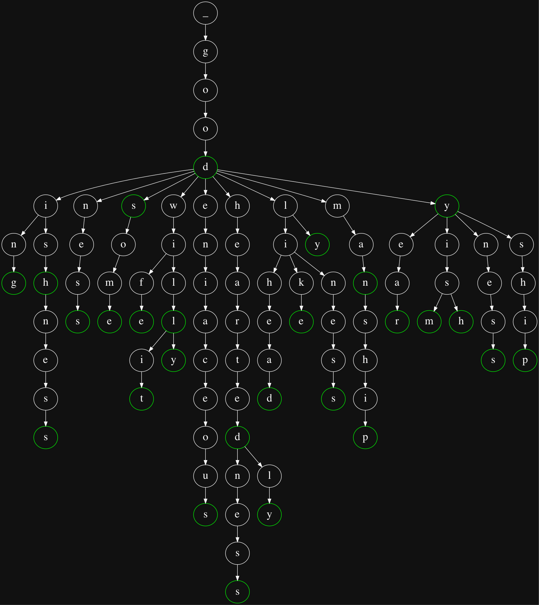

# Tried

A trie data structure implementation in Go.

## Usage

```
$ go build
$ ./tried -help
Usage of ./tried:
  -dict string
        File which contains the words registered for autocompletion (default "/usr/share/dict/words")
  -dot
        Dump a dot representation of the trie for graphviz
  -prefix string
        Get a trie that only starts with a prefix
  -words
        Print the words contained in the trie
```

### Graphviz



```
$ go run main.go | dot -Tpng > graph.png
```

## References

- [Wikipedia][1]
- [Jacob Sorber's video][2]
- [Tsoding's live][3]

## TODO

- [x] Sort the prefix result by edit distance
      ```
      lev "" s2 = length s2
      lev s1 "" = length s1
      lev (x:s1) (y:s2)
          | x == y = lev s1 s2
          | x /= y = 1 + min (lev (x:s1) s2) (lev s1 (y:s2))
      ```
- [x] Convert trie to a graphviz dot file
- [x] Make autocompletion with ncurses
- [ ] Make trie rune comparison case insensitive
- [ ] Optimize by triming the nodes with only one child (radix tree)
      ```
      b -> a -> l -> l
             -> s -> e
      ```
      to:
      ```
      ba -> ll
         -> se
      ```

[1]: https://en.wikipedia.org/wiki/Trie
[2]: https://www.youtube.com/watch?v=3CbFFVHQrk4
[3]: https://www.youtube.com/watch?v=2fosrL7I7oc
